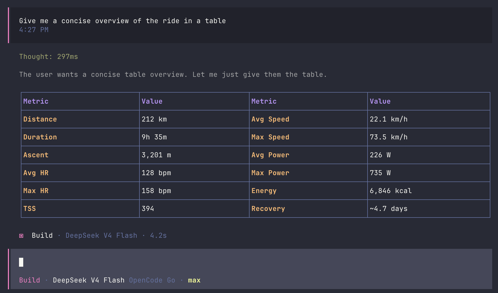
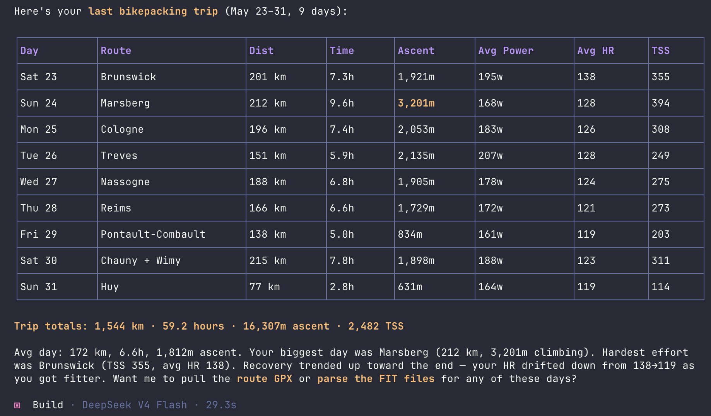

# Suunto MCP

[](https://github.com/jb381/suunto-mcp/actions/workflows/ci.yml)

Ask your Suunto data better questions.

Suunto MCP is a [FastMCP](https://gofastmcp.com/) server for Suunto Cloud API
workouts, routes, 24/7 health data, local FIT/GPX files, Apple Health exports,
and webhook workflows. It is built for people who want their training data
available inside an MCP client without handing every operation a write key by
default.

<p>
  
  
</p>

## What You Can Do

- Ask for recent workouts, complete workout details, FIT downloads, and parsed
  workout summaries.
- Compare activity, sleep, recovery, and daily 24/7 statistics without burning
  through Suunto's weekly API quota by accident.
- Parse local FIT, GPX, CSV/TSV, normalized JSON, and Apple Health `export.xml`
  files even without Suunto API credentials.
- Export and inspect routes as GPX.
- Receive Suunto webhooks, verify HMAC signatures, store events locally, and ask
  what follow-up fetch makes sense.
- Enable write tools only when you intentionally want route imports, workout
  uploads, SuuntoPlus Guide mutations, or workout add-info calls.

Write/push tools are off unless `SUUNTO_ENABLE_WRITE_TOOLS=true`.

## Quick Start

Requirements:

- Python 3.12 or newer
- [`uv`](https://docs.astral.sh/uv/)
- Suunto API Zone credentials for cloud access

Local file parsing works without Suunto credentials.

```bash
git clone https://github.com/jb381/suunto-mcp.git
cd suunto-mcp
uv sync
cp .env.example .env
```

Edit `.env`:

```env
SUUNTO_CLIENT_ID=your_client_id
SUUNTO_CLIENT_SECRET=your_client_secret
SUUNTO_REDIRECT_URI=http://localhost:8080/callback
SUUNTO_SUBSCRIPTION_KEY=your_subscription_key

SUUNTO_TOKEN_STORE=keyring
SUUNTO_API_CALLS_PER_MINUTE=10
SUUNTO_API_WEEKLY_CALL_LIMIT=200
```

In Suunto API Zone, set the OAuth redirect URI to exactly the same value as
`SUUNTO_REDIRECT_URI`.

Run the stdio MCP server:

```bash
uv run suunto-mcp
```

## Add It To An MCP Client

Example local command configuration:

```json
{
  "mcpServers": {
    "suunto": {
      "command": "uv",
      "args": ["run", "--directory", "/absolute/path/to/suunto-mcp", "suunto-mcp"]
    }
  }
}
```

For local HTTP testing:

```bash
uv run suunto-mcp --transport streamable-http --host 127.0.0.1 --port 8000
```

Most MCP clients should connect to:

```text
http://127.0.0.1:8000/mcp
```

If you bind HTTP, SSE, or streamable HTTP to a non-local host, set
`SUUNTO_MCP_API_TOKEN`. The server refuses non-local HTTP binds without it.

## First Suunto Authorization

Once the server is running in your MCP client:

1. Call `suunto_get_authorization_url`.
2. Open the returned URL and authorize with your Suunto App account.
3. Copy the `code` from the redirect URL.
4. Call `suunto_exchange_authorization_code` with that code.
5. Call `suunto_list_accounts`.
6. Try `suunto_list_workouts`.

For command-line OAuth debugging:

```bash
source .env
open "https://cloudapi-oauth.suunto.com/oauth/authorize?response_type=code&client_id=$SUUNTO_CLIENT_ID&redirect_uri=$SUUNTO_REDIRECT_URI"
```

Then exchange the returned code:

```bash
curl https://cloudapi-oauth.suunto.com/oauth/token \
  --user "$SUUNTO_CLIENT_ID:$SUUNTO_CLIENT_SECRET" \
  -d grant_type=authorization_code \
  -d redirect_uri="$SUUNTO_REDIRECT_URI" \
  -d code="PASTE_CODE_HERE"
```

Import the returned token JSON with `suunto_import_token_set` or
`suunto_import_token_file`.

## Example Workflows

Try prompts like:

- "Show my last 10 Suunto workouts and flag anything unusually long or intense."
- "Fetch the full details for yesterday's run and summarize pace, heart rate, and
  elevation."
- "Parse this GPX file and tell me distance, ascent, and whether the route looks
  like a loop."
- "Import this Apple Health export and summarize workouts by type."
- "List stored Suunto webhook events and suggest which ones need a follow-up API
  fetch."
- "Estimate how many 24/7 summary calls this date range will use before fetching
  it."

Useful resources exposed by the server:

- `suunto://config` shows redacted runtime configuration.
- `suunto://quota` shows local API quota usage.
- `suunto://coverage` maps Suunto API areas to implemented tools.
- `suunto://api-catalog` lists the tool groups.

## Optional Settings

File token storage, useful for development:

```env
SUUNTO_TOKEN_STORE=file
SUUNTO_TOKEN_FILE=.suunto-mcp/tokens.json
```

HTTP transport bearer auth:

```env
SUUNTO_MCP_API_TOKEN=generate-a-long-random-token
```

Webhook verification and storage:

```env
SUUNTO_WEBHOOK_SECRET=generate-a-long-random-secret
SUUNTO_WEBHOOK_STORE=sqlite
SUUNTO_WEBHOOK_STORE_PATH=.suunto-mcp/webhooks.sqlite3
```

Write tools:

```env
SUUNTO_ENABLE_WRITE_TOOLS=false
```

Keep that false unless you intentionally want write operations callable.

## Webhooks

HTTP transports expose:

- `POST /webhooks/suunto`
- `POST /webhooks/suunto/workout`
- `POST /webhooks/suunto/route`
- `POST /webhooks/suunto/247/activity`
- `POST /webhooks/suunto/247/sleep`
- `POST /webhooks/suunto/247/recovery`
- `POST /webhooks/suunto/legacy-workout`

When `SUUNTO_WEBHOOK_SECRET` is configured, webhook routes require a valid
`X-HMAC-SHA256-Signature` header. For anything persistent, prefer SQLite storage.

Use `suunto_suggest_webhook_followups` on a stored event to find the next likely
fetch tool for workout, route, and 24/7 notifications.

## Safety

- `.env`, `.suunto-mcp/`, token files, webhook stores, quota ledgers, and exports
  are gitignored.
- Tool responses do not include stored access or refresh token values.
- Signed upload URLs are redacted in upload initialization responses.
- Non-local HTTP/SSE/streamable HTTP transports require `SUUNTO_MCP_API_TOKEN`.
- Cloud API calls are paced and counted locally with `SUUNTO_API_CALLS_PER_MINUTE`
  and `SUUNTO_API_WEEKLY_CALL_LIMIT`.
- Write/push tools require `SUUNTO_ENABLE_WRITE_TOOLS=true`.

Set `SUUNTO_API_WEEKLY_CALL_LIMIT=0` only when you intentionally want to disable
the local weekly guard.

## Development

```bash
uv sync --dev
uv run ruff format --check .
uv run ruff check .
uv run pyright
uv run pytest
```

Live read-only tests are opt-in:

```bash
SUUNTO_LIVE_TESTS=true \
SUUNTO_LIVE_TOKEN_FILE=.suunto-mcp/oauth-test-token.json \
uv run pytest tests/live
```

## Release Checklist

Before publishing:

1. Confirm `.env`, `.suunto-mcp/`, exported files, and token files are absent from
   `git status --short`.
2. Run `uv sync --dev --locked`.
3. Run the full development check suite.
4. Run `uv build`.
5. Keep `SUUNTO_ENABLE_WRITE_TOOLS=false` in examples and defaults.
6. Update `CHANGELOG.md`.
7. Tag the release, for example `git tag v0.1.0`.

## Suunto Docs

- [API catalog](https://apizone.suunto.com/apis)
- [Quick start and OAuth](https://apizone.suunto.com/how-to-start)
- [FAQ and operational notes](https://apizone.suunto.com/faq)

## License

MIT. See [LICENSE](LICENSE).
